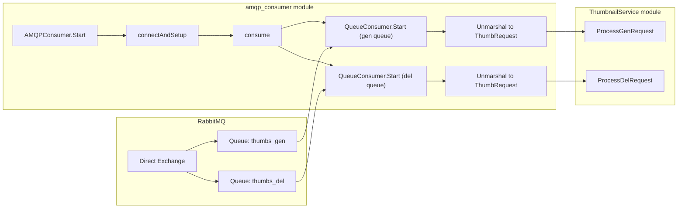

# Architecture

## AMQP Consumption

The consumer layer owns transport concerns (RabbitMQ connectivity, queue bindings, ack/nack), then hands validated requests to the service layer so business logic stays decoupled from AMQP details.

- `cmd/thumbnailer/main.go` calls `AMQPConsumer.Start(ctx)` to initialize AMQP consumption lifecycle.
- `AMQPConsumer.connectAndSetup()` connects to RabbitMQ, opens channel, declares exchange/queues, binds queues, and configures QoS.
- `AMQPConsumer.consume(ctx)` creates one `QueueConsumer` per queue and starts both concurrently.
- Each `QueueConsumer.Start(...)` reads deliveries from its queue with manual ack/nack behavior.
- Message bodies are unmarshaled into `models.ThumbRequest` in consumer callbacks.
- Parsed requests are passed to service entry points:
  - `thumbnailSvc.ProcessGenRequest(ctx, thumbRequest)`
  - `thumbnailSvc.ProcessDelRequest(ctx, thumbRequest)`
- `ThumbnailsService` executes thumbnail business workflows while remaining independent from AMQP transport logic.

